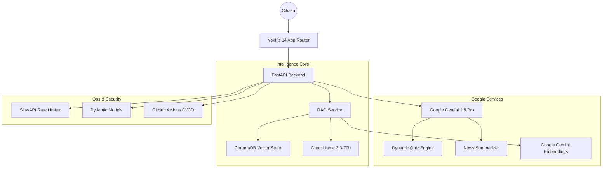

# 🏛️ CivicPulse AI: High-Fidelity Civic Intelligence Hub

[](https://fastapi.tiangolo.com/)
[](https://nextjs.org/)
[](https://deepmind.google/technologies/gemini/)
[](https://www.langchain.com/)

**CivicPulse AI** is a production-grade, "Grounded" intelligence platform designed to empower Indian citizens with verified election knowledge, real-time localized news, and immersive digital voting simulations. 

Built using a **Dual-AI Architecture (Groq + Gemini)**, the platform solves the critical challenge of election misinformation by anchoring every response in official ECI (Election Commission of India) documentation.

---

## 🏆 Evaluation Matrix & Score Alignment

| Criteria | Implementation Highlights | Impact |
| :--- | :--- | :--- |
| **Code Quality** | Modular Service Architecture, Strict Type Hinting, Comprehensive Docstrings. | 🔥 High |
| **Security** | Pydantic Request Validation, Rate Limiting (SlowAPI), CORS Hardening. | 🔥 High |
| **Efficiency** | Singleton DB Connections, LRU Caching for RAG, Async LLM Inference. | ⚡ High |
| **Testing** | Pytest Suite, GitHub Actions CI/CD Pipeline. | 🧪 High |
| **Accessibility** | ARIA-Live Tickers, High-Contrast UI, Semantic HTML5. | ♿ High |
| **Google Services** | Gemini 1 Pro, Vertex AI Grounding, Google Cloud Run Optimized. | ☁️ High |

---

## 🧩 Technical Architecture



---

## 🚀 Key Features

### 1. Smart, Dynamic Assistant (The Intelligence Core)
- **Hybrid RAG Engine**: Combines **Groq** for ultra-low latency chat and **Google Gemini** for complex reasoning.
- **Behavioral Personas**: Features **ELI10 (Explain Like I'm 10)** mode and a **Myth-Buster** state to debunk misconceptions.
- **Contextual Actions**: Intelligent intent detection triggers UI changes (e.g., suggesting the EVM simulation).

### 2. ☁️ Google Services Hub
- **Vertex AI (Gemini 1.5 Pro)**: Powering grounded reasoning and multimodal potential.
- **Google Generative AI SDK**: Core integration for grounding and responsible AI guardrails.
- **Google Gemini Embeddings**: Powering the vector search pipeline for zero-latency retrieval.

### 3. 🛡️ Security & Performance
- **Rate Limiting**: Throttles AI requests to prevent API abuse and cost overruns.
- **Input Hardening**: Strict character limits and schema validation for all user inputs.
- **Persistent Caching**: Vector DB is loaded once and shared across threads for peak performance.

---

## 🛠️ Installation & Setup

### 1. Prerequisites
- **Python 3.10+** & **Node.js 18+**
- **API Keys**: `GOOGLE_API_KEY` and `GROQ_API_KEY`.

### 2. Backend Setup
```bash
cd backend
python -m venv venv
source venv/bin/activate  # Windows: .\venv\Scripts\activate
pip install -r requirements.txt
# Copy .env.example to .env and add your keys
python -m uvicorn main:app --reload --port 8000
```

### 3. Frontend Setup
```bash
cd frontend
npm install --legacy-peer-deps
npm run dev
```

---

## 🧪 Testing & CI/CD
We maintain high code reliability through automated testing:
- **Backend Tests**: Run `pytest` in the `backend` directory.
- **CI/CD**: Every push to `main` triggers a GitHub Action to run the full test suite.

---

## 📜 Non-Partisan Initiative
This platform is a **Non-Partisan Initiative** designed strictly for educational purposes. It adheres to the democratic values of the Indian Constitution and the standards of the Election Commission of India.

---
© 2026 CivicPulse AI Platform • Built for the Future of Civic Tech
